<p align="center"> 
    
    <h1 align="center">Playlist-Manager</h1>
</p>

This is a project in development of a **Youtube** playlist manager to handle content consumption habits.

---

### In development

This is the main endpoint so far, the idea behind it is for the endpoint try to authenticate the client with **OAuth2.0** using the **Google** account, then after being authenticated **session endpoint** gets called with the session token as a query params.

<p align="center">

</p>

```json
// GET - {base_url}/playlists/list

{
  "content": {
    "title": "Useful Content",
    "description": "This is a playlist where I’ll keep track of my good content consumption habits",
    "itemCount": 64,
    "minutesWatched": 1457.8333333333337
  }
}
```
